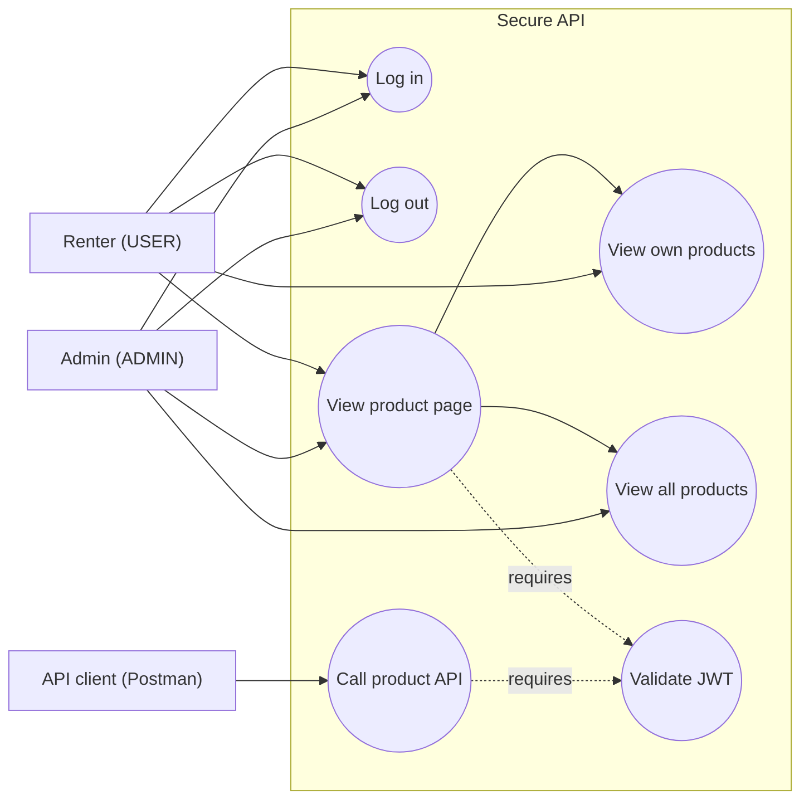
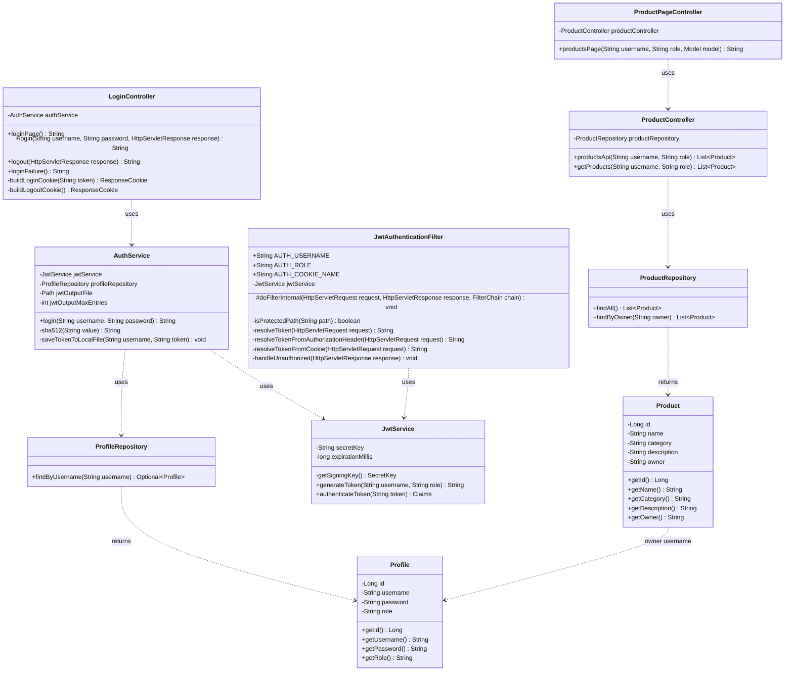
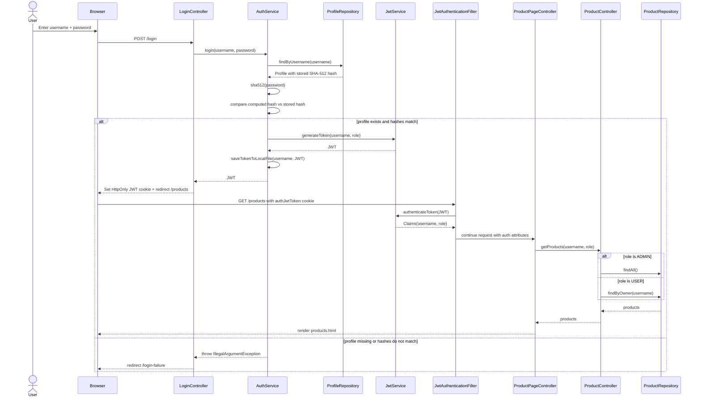
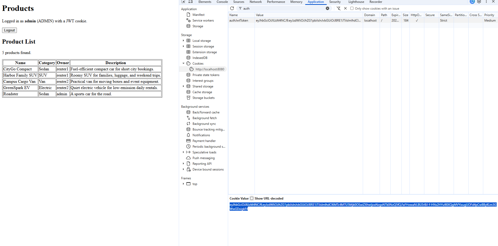
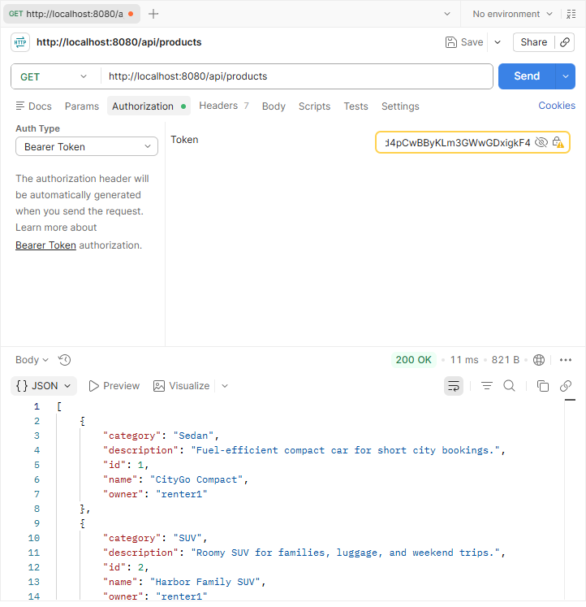

# Spring Boot JWT Demo

Basic Spring Boot and Thymeleaf demo for JWT login.

## Overview

- A login page sends username and password to the backend.
- The backend checks the user in MySQL.
- Passwords are stored as SHA-512 hashes, not plaintext. The backend hashes the submitted password and compares it to the stored hash.
- The backend generates a JWT after successful login.
- The JWT is saved to `generated-jwts.txt` for students to copy into jwt.io.
- The backend stores the JWT in an `HttpOnly` cookie for the browser.
- Thymeleaf renders the login, failure, and product pages on the server.
- Postman can call the product API with `Authorization: Bearer <jwt>`.
- Admin users can see all products. Normal users see only their own products.

## Application Flow

1. The student opens the frontend login view at `/`.
2. Spring MVC renders `src/main/resources/templates/index.html`.
3. The login form submits username and password to `POST /login`.
4. The request reaches `src/main/java/sg/edu/nus/secure_api/controller/LoginController.java`.
5. `LoginController.java` calls `src/main/java/sg/edu/nus/secure_api/service/AuthService.java`.
6. `AuthService.java` looks up the user with `src/main/java/sg/edu/nus/secure_api/repository/ProfileRepository.java`, hashes the submitted password with SHA-512, and compares it to the stored hash.
7. If the login is valid, `AuthService.java` calls `src/main/java/sg/edu/nus/secure_api/service/JwtService.java` to generate a JWT.
8. `AuthService.java` saves the generated JWT into `generated-jwts.txt`.
9. `LoginController.java` stores the JWT in an `HttpOnly` cookie and redirects to `/products`.
10. Before `/products` reaches the controller, `src/main/java/sg/edu/nus/secure_api/security/JwtAuthenticationFilter.java` checks whether the JWT cookie is valid.
11. If the JWT is valid, `ProductPageController.java` reads products and prepares the page model.
12. Spring MVC renders the final product view with `src/main/resources/templates/products.html`.
13. If login fails, Spring MVC redirects to `/login-failure` and renders `src/main/resources/templates/login-failure.html`.

`ProductPageController.java` renders the Thymeleaf product page.
`ProductController.java` is a REST controller for Postman/API access.

## Where to Send and Extract JSON

These are the two endpoints where data crosses between the browser and the backend.

| Purpose | Endpoint | Direction | Controller |
|---|---|---|---|
| Login (send credentials) | `POST /login` | Browser → Backend | `LoginController.login(...)` |
| Product API (extract JSON) | `GET /api/products` | Backend → Browser | `ProductController.productsApi(...)` (`@RestController`) |

- **Send to the backend:** the login at `POST /login` is where the browser sends the username and password.
- **Extract from the backend:** the product API at `GET /api/products` is where the backend returns the product list as JSON (requires a valid JWT).

## Diagram

### Use Case Diagram




### Class Diagram




### Sequence Diagram (Login with Hashed Password)




## How to Get the JSON from the Product API

The `/api/products` endpoint only accepts the JWT in the `Authorization: Bearer` header
(the browser cookie alone does not work for the API). So you must send the token in the header.

First, get a token:

1. Log in through the browser (for example `admin` / `admin123`).
2. Get the JWT in one of two ways:
   - Copy the latest JWT from `generated-jwts.txt`, or
   - Press `F12` to open DevTools, go to the **Application** tab, open **Cookies**, and
     copy the value of the `authJwtToken` cookie.



Then call the API with one of the methods below.

### Method 1: Postman

1. Set the request to `GET http://localhost:8080/api/products`.
2. Open the **Authorization** tab, choose **Bearer Token**, and paste the JWT into the **Token** field.
3. Click **Send**.

```text
GET http://localhost:8080/api/products
Authorization: Bearer YOUR_JWT_HERE
```

The JSON product list appears in the response body.



### Method 2: curl (PowerShell)

In PowerShell, use `curl.exe`:

```powershell
curl.exe -H "Authorization: Bearer YOUR_JWT_HERE" http://localhost:8080/api/products
```

The JSON is printed directly in the terminal.

## Database Setup

Open MySQL Workbench and run:

```text
database/init.sql
```

This creates:

- `profiles`
- `products`

## Run

Set environment variables in PowerShell:

```powershell
$env:DB_USERNAME="root"
$env:DB_PASSWORD="YOUR_PASSWORD"
$env:JWT_SECRET="use-a-long-demo-secret-key-at-least-32-characters"
```

Start the app:

```powershell
.\mvnw.cmd spring-boot:run
```

Open:

```text
http://localhost:8080
```

## JWT Output File

After each successful login, the server writes the generated JWT to:

```text
generated-jwts.txt
```

The file keeps only the latest tokens. Change this number in:

```properties
jwt.output-max-entries=5
```
